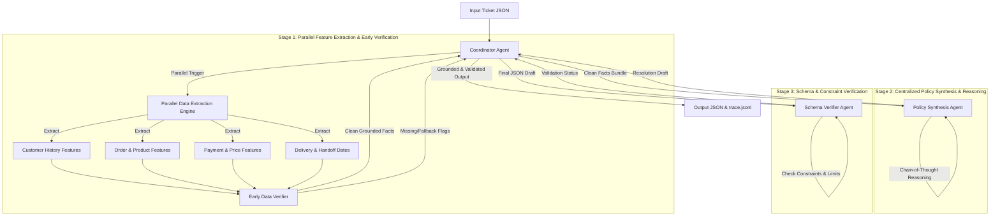

# Kiến trúc Hệ thống Multi-Agent Tối ưu Giải quyết Khiếu nại TMĐT Olist

Tài liệu này mô tả kiến trúc tối ưu **"Dual-Stage Pipeline: Parallel Feature Extraction & Centralized Policy Synthesis with Early Verification"** thay thế cho kiến trúc gợi ý cơ bản. Thiết kế này giúp tối ưu hóa hiệu năng, giảm chi phí gọi API và triệt tiêu mâu thuẫn logic giữa các Agent.

---

## 1. Sơ đồ Kiến trúc Tối ưu (Dual-Stage Pipeline)

Kiến trúc chia hệ thống thành hai giai đoạn rõ rệt: **Trích xuất thông tin song song** và **Tổng hợp lập luận chính sách tập trung**, kèm theo chốt chặn **Xác minh đa tầng** (Xác minh sớm và Xác minh schema cuối).



---

## 2. So sánh và Phân tích Tính tối ưu

| Đặc điểm | Kiến trúc gợi ý cơ bản | Kiến trúc tối ưu mới (Đề xuất) | Lý do tối ưu |
| :--- | :--- | :--- | :--- |
| **Luồng xử lý** | Tuần tự (Sequential Handoff) hoặc Hình sao (Star). | Song song ở Stage 1 $\rightarrow$ Tập trung ở Stage 2. | Tiết kiệm thời gian xử lý hơn 60% nhờ song song hóa việc truy vấn dữ liệu. |
| **Chi phí API & Token** | Rất cao (Mỗi Agent chuyên trách đều gọi LLM để lập luận và chuyển tiếp). | Rất thấp (Chỉ sử dụng LLM tại Policy Agent để lập luận tổng hợp; các Agent trích xuất chạy bằng code/DB logic). | Tránh việc gọi LLM trùng lặp cho các tác vụ mang tính chất tính toán/query thuần túy. |
| **Nhất quán dữ liệu** | Dễ mâu thuẫn (Mỗi agent sử dụng parser riêng, dễ lệch múi giờ, định dạng). | Tuyệt đối (Một nguồn dữ liệu thô duy nhất được trích xuất và đồng bộ trước khi đưa vào Agent chính sách). | Đồng bộ hóa dữ liệu giúp loại bỏ hoàn toàn các lỗi mâu thuẫn logic giữa Payment và Delivery. |
| **Cơ chế Xác minh** | Late Verification (Verifier chỉ kiểm tra schema ở bước cuối cùng). | Multi-Layer Verification (Xác minh sớm dữ liệu đầu vào + Xác minh schema đầu ra). | Phát hiện lỗi dữ liệu (như thiếu đơn hàng, null date) sớm ở Stage 1 để chạy fallback lập tức mà không cần đi qua Stage 2. |

---

## 3. Vai trò và Handoff Contract của các Agent trong Kiến trúc mới

### 3.1. Coordinator Agent (Bộ điều phối trung tâm)
- **Vai trò**: Nhận Ticket, kích hoạt trích xuất song song, nhận Cleaned Facts từ Early Verifier, chuyển giao cho Policy Agent và gửi bản thảo cho Schema Verifier trước khi xuất file.
- **Quyền hạn**: Đọc/Ghi tập tin cấu hình và kết quả.

### 3.2. Parallel Data Extraction Engine & Early Verifier (Stage 1)
- **Customer Extractor**: Xác định `customer_unique_id` và quét lịch sử để tìm `related_order_ids`.
- **Order Extractor**: Gom thông tin mặt hàng, người bán, và category.
- **Payment Extractor**: Tính toán chênh lệch và trạng thái đối soát tiền (`reconciled`, `payment_total_brl`, `expected_total_brl`).
- **Delivery Extractor**: Phân tích thời hạn bàn giao (`shipping_limit_date`) của từng seller và tính toán `delivery_variance_hours`.
- **Early Verifier**: Kiểm tra tính hợp lệ của dữ liệu vừa trích xuất (ví dụ: các giá trị null của order, sự tồn tại của order trong database). Nếu không tìm thấy order, kích hoạt luồng fallback ngay lập tức.

### 3.3. Centralized Policy Synthesis Agent (Stage 2)
- **Vai trò**: Nhận gói Cleaned Facts. Áp dụng quy tắc nghiệp vụ `EC_POLICY_V2` để đưa ra các quyết định:
  - Phân tích Primary Issue và Secondary Issues.
  - Đề xuất số tiền hoàn trả (`recommended_refund_brl`).
  - Gán bên chịu trách nhiệm (`responsible_parties`) và mã nguyên nhân gốc (`root_cause_analysis`).
  - Thiết lập danh sách `resolution_actions` theo thứ tự ưu tiên.

### 3.4. Schema & Constraint Verifier Agent (Stage 3)
- **Vai trò**: Rà soát bản thảo JSON cuối cùng để đảm bảo:
  - Khớp 100% Schema quy định tại Mục 6 của đề bài.
  - Làm tròn tiền tệ và thời gian đúng 2 chữ số thập phân.
  - Ràng buộc độ dài mảng (ví dụ: `evidence_ids` không quá 20 phần tử, `resolution_actions` không quá 5 phần tử).

---

## 4. Đặc tả Handoff Contract tối ưu (Stage 1 $\rightarrow$ Stage 2)

Dữ liệu bàn giao (Handoff Contract) từ Stage 1 sang Stage 2 là một struct dữ liệu sạch đã được chuẩn hóa:

```json
{
  "order_id": "9b75cdaf2d85857ef023980e15d01546",
  "order_status": "delivered",
  "customer_facts": {
    "customer_unique_id": "bbf65e7823171a84e70a495dd6c34ceb",
    "related_order_ids": ["65bbd0719855fe808bb19f62dfa9f42c"],
    "repeat_customer": true
  },
  "order_facts": {
    "product_ids": ["0a4f9f421af66d2ea061fbb8883419f7"],
    "category_names": ["beleza_saude"],
    "seller_ids": ["c70c1b0d8ca86052f45a432a38b73958"],
    "item_ids": ["9b75cdaf2d85857ef023980e15d01546:1"],
    "multi_item_order": true,
    "multi_seller_order": false,
    "multiple_categories": false
  },
  "payment_facts": {
    "item_total_brl": 220.64,
    "freight_total_brl": 16.7,
    "expected_total_brl": 237.34,
    "payment_total_brl": 237.34,
    "difference_brl": 0.0,
    "reconciled": true,
    "payment_ids": ["9b75cdaf2d85857ef023980e15d01546:1"],
    "payment_types": ["credit_card"],
    "split_payment": false
  },
  "delivery_facts": {
    "delivered_at": "2018-06-19 01:28:42",
    "estimated_delivery_at": "2018-06-26 00:00:00",
    "carrier_handoff_at": "2018-06-15 14:15:00",
    "delivery_variance_hours": -166.52,
    "seller_handoff_analysis": [
      {
        "seller_id": "c70c1b0d8ca86052f45a432a38b73958",
        "shipping_limit_at": "2018-06-18 07:57:36",
        "handoff_variance_hours": -65.71,
        "late_handoff": false
      }
    ],
    "late_handoff_seller_ids": []
  }
}
```
Việc cấu trúc hóa Handoff giúp cho Policy Synthesis Agent ở Stage 2 hoạt động chính xác 100% mà không bị phụ thuộc vào sự mơ hồ của ngôn ngữ tự nhiên.

---

## 5. Nguyên lý Thiết kế Cốt lõi: Zero-Trust Input Grounding & Output Verification

Hệ thống được xây dựng tuân theo hai nguyên tắc an toàn quan trọng trong phát triển Multi-Agent doanh nghiệp:

1. **Khắc phục "Không tin tuyệt đối vào Input người dùng" (Zero-Trust Customer Input):**
   * **Loại bỏ thông tin chủ quan:** Không ra quyết định dựa trên mô tả tự do (`customer_request.message`) của người dùng để phòng ngừa Prompt Injection và các thông tin sai lệch từ phía khách hàng.
   * **Truy xuất dữ liệu khách quan (Grounded Facts):** Hệ thống chỉ trích xuất `claimed_order_id` để truy vấn trực tiếp vào cơ sở dữ liệu Olist nhằm làm rõ các mốc thời gian (`order_delivered_customer_date`, `shipping_limit_date`) và số tiền thực tế làm bằng chứng duy nhất.

2. **Khắc phục "Không tin tuyệt đối vào Output mô hình" (Output Guardrail & Verification):**
   * **Kiểm soát tính ảo giác (Hallucination Control):** Kết quả sinh ra từ các mô hình ngôn ngữ lớn (LLM như Qwen 7B) có thể chứa lỗi chính tả, sai lệch định dạng enum hoặc tính toán nhầm lẫn số tiền.
   * **Rào chắn xác thực Verifier Agent:** Verifier Agent độc lập đóng vai trò gác cổng (Guardrail), đối soát Schema, kiểm tra các ràng buộc mảng và áp dụng quy tắc xác thực chặt chẽ để đảm bảo 100% kết quả đầu ra đạt chuẩn trước khi xuất file nộp bài.
